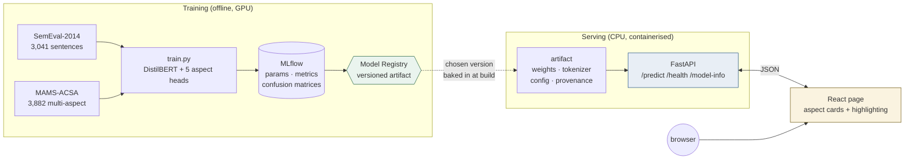

# Aspect-Based Sentiment Analysis

[](https://github.com/Ad1roxx/aspect-based-sentiment-analysis/actions/workflows/ci.yml)

Predicts sentiment for five aspects of a restaurant review — **food, service, ambience, price,
misc** — rather than one score for the whole sentence. A review can praise the food and condemn the
service, and this says so.

Trained on SemEval-2014 Task 4, served by FastAPI, consumed by a React page, containerised, and
tested on every push.

```
"The pasta was incredible but the waiter ignored us."

  food      positive  98.5%
  service   negative  95.3%
  ambience  not discussed
  price     not discussed
  misc      not discussed
```

---

## Architecture



**The model is five 4-way classifiers over one shared encoder.** Each aspect is independently
`absent / negative / neutral / positive`, so a single forward pass answers both *"is this discussed?"*
and *"how do they feel about it?"*. Making absence its own class is what lets one model do both —
78% of training sentences mention only one aspect, so a plain 3-class scheme has nowhere to put
"this review never talks about price".

---

## Results

Held-out SemEval-2014 gold test set (800 sentences), macro-F1 per aspect:

| aspect | macro-F1 |
|---|---|
| food | 0.678 |
| service | 0.666 |
| misc | 0.651 |
| price | 0.615 |
| ambience | 0.580 |
| **overall** | **0.638** |

How it got there — each step measured, not assumed:

| | test macro-F1 |
|---|---|
| baseline (DistilBERT, `[CLS]` pooling) | 0.550 |
| \+ class-weighted loss (`sqrt-inverse`) | 0.629 |
| \+ per-aspect attention pooling | 0.632 |
| \+ MAMS supplementary data | **0.638** |

The headline number understates the useful part. Detection of aspects in **multi-aspect** sentences —
the case that matters, and the one macro-F1 averages away — improved far more:

| | before | after |
|---|---|---|
| single-aspect sentences | 89.3% | 88.8% |
| **multi-aspect sentences** | **76.7%** | **82.3%** |
| the gap | 0.125 | **0.064** |

---

## Quick start

### Docker (everything)

```bash
docker compose up --build
#   API   http://localhost:8000/docs
#   page  http://localhost:8080
```

Needs a trained artifact in `ml/models/absa-distilbert/` first — it is ~254 MB and gitignored, so
it is not in the repo:

```bash
python scripts/download_data.py
python ml/src/train.py --extra-data relabelled --pooling attention \
    --class-weights sqrt-inverse --eval-test --register
```

### Local

```bash
python -m venv .venv && .venv/Scripts/activate      # or source .venv/bin/activate
pip install -r requirements.txt -r requirements-dev.txt
python scripts/download_data.py

uvicorn api.main:app --reload --port 8000           # terminal 1
cd frontend && npm install && npm run dev           # terminal 2
```

`requirements.txt` pins the **CUDA** torch build for training. For CPU-only use
`requirements-serve.txt` plus `pip install torch==2.13.0 --index-url https://download.pytorch.org/whl/cpu`.

### Tests

```bash
pytest                        # 147
pytest -m "not integration"   # 125 — no GPU, no artifact, no network. This is what CI runs.
```

---

## Layout

```
ml/src/       data · model · train · evaluate · explain · tracking · serving · mams
api/          FastAPI app, schemas, model service
frontend/     React + Vite page
tests/        147 tests, layered so most need no model
scripts/      pinned, checksum-verified dataset download
explanations/ one write-up per sprint — the reasoning behind every decision
TESTING.md    manual checklist, incl. known limitations
```

---

## Decisions worth knowing

Full reasoning in [`explanations/`](explanations/) — one file per sprint.

| decision | why |
|---|---|
| **Absence is a class**, not a separate detector | one forward pass answers detection *and* sentiment |
| **`sqrt-inverse` class weights**, not full inverse | textbook inverse weighting scored *below* baseline; the damped variant beat it |
| **Per-aspect attention pooling** | one shared `[CLS]` vector meant every aspect read identical evidence |
| **Gradient × input for explanations**, not attention | attention over a shared `[CLS]` is identical for all five aspects — it *looks* like an explanation and is not one |
| **Unsigned importance** | the sign was measured to be untrustworthy, so it is not reported |
| **API loads from disk, not the MLflow registry** | serving must not depend on a tracking database being reachable |
| **sqlite MLflow backend** | the file store is in maintenance mode on MLflow 3.x and never supported the registry |
| **CPU torch in the image** | the CUDA build is 8.4 GB of kernels a CPU service never calls |

---

## Limitations

Measured, not guessed. Fuller detail in [`TESTING.md`](TESTING.md) section 6.

**`neutral` barely works outside `misc`.** F1 is 0.000 for service, ambience and price on the test
set — but their supports are 3, 8 and 1 examples. This is a data problem, not a tuning problem:
class weighting was tried and moved it not at all. MAMS supplementary data more than doubled average
neutral F1 (0.119 → 0.243), which is the only thing that has.

**Multi-aspect sentences are still weaker.** 82.3% detection versus 88.8% for single-aspect. Halved
from the original gap, not closed.

**Negation is learned per word, not as a rule.** `not good` flips correctly (40 negated examples in
training); `not overpriced` does not (3). The cutoff sits around six examples. A 66M-parameter
distilled model has not generalised the operation.

**Confidence is not calibrated.** It is a softmax preference among four options, not a probability of
being correct. The UI surfaces it anyway, because a *lost* aspect sits near 0.46–0.52 while a
genuinely absent one sits at 0.93–0.96 — a signal worth showing even uncalibrated.

**The word "place" over-triggers ambience** — 18.4% false-positive rate versus 3.2% elsewhere.
Three fixes were built for this and all three made ambience measurably *worse*, so the data stays as
it is. The rejected variants remain behind `--extra-data` flags.

**Explanations are a local, first-order approximation.** They show what the model used, not that it
was right, and punctuation sometimes ranks highest.

**English restaurant reviews only**, and American spellings at that — `cosy` is out of vocabulary
where `cozy` is not.

---

## Future work

Deliberately not built, in rough order of expected value:

- **A larger encoder** (RoBERTa / DeBERTa-v3). The single most likely fix for negation, and one
  training run to test.
- **Per-aspect confidence thresholds.** Measured to be worth it for service (3:1 favourable) and
  ambience (1.4:1), and actively harmful for food and price — so it must be per-aspect, tuned on
  validation.
- **Integrated Gradients**, for attributions with a real baseline rather than the zero vector.
- **Deployment.** `release.yml` publishes images to GHCR on a tag; pointing them at a host is a
  separate step and is not pretended otherwise.
- **Calibration** (temperature scaling), which would make the confidence number mean what people
  assume it means.

---

## Data

- **SemEval-2014 Task 4** — restaurant reviews, aspect categories and polarities. Fetched by
  `scripts/download_data.py`, pinned by upstream commit and verified by SHA-256.
- **MAMS-ACSA** ([Jiang et al., EMNLP-IJCNLP 2019](https://aclanthology.org/D19-1654/), Apache-2.0) —
  supplementary sentences that all contain at least two aspects with *differing* polarities. It
  shares a source corpus with SemEval, so the loader removes the 67 overlapping sentences — 11 of
  which are in the test split — before anything is trained.

Neither corpus is redistributed here; both are downloaded and checksum-verified.
